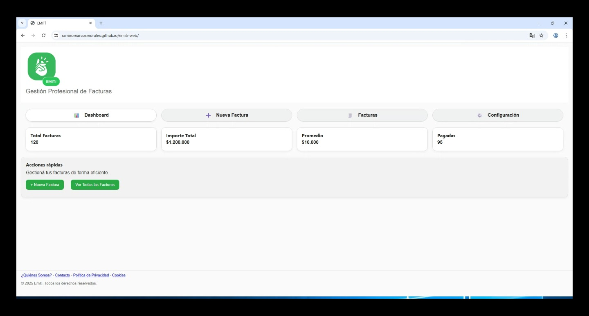
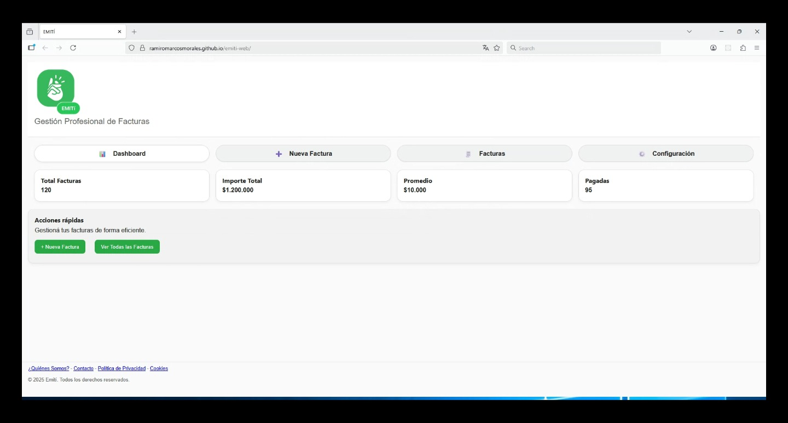
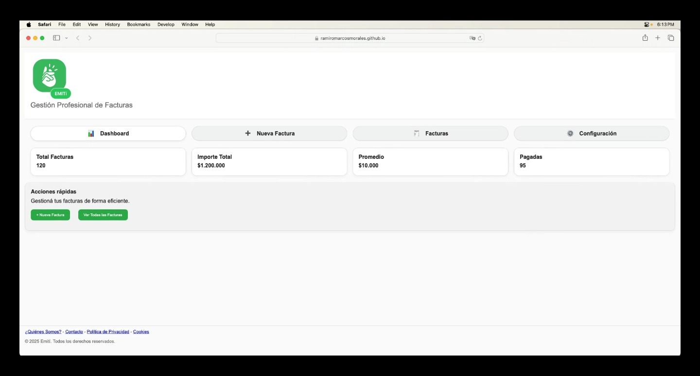
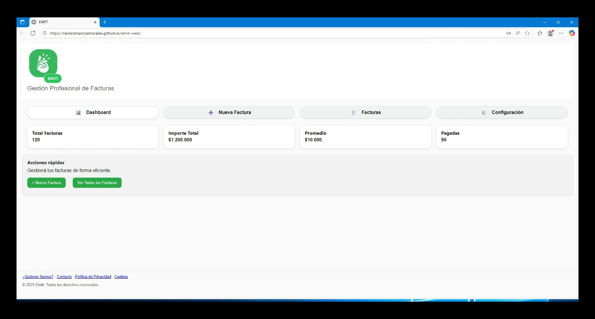
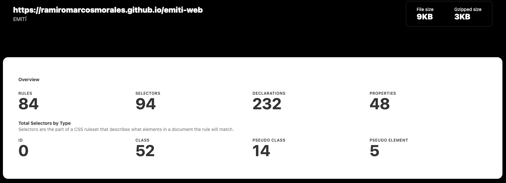
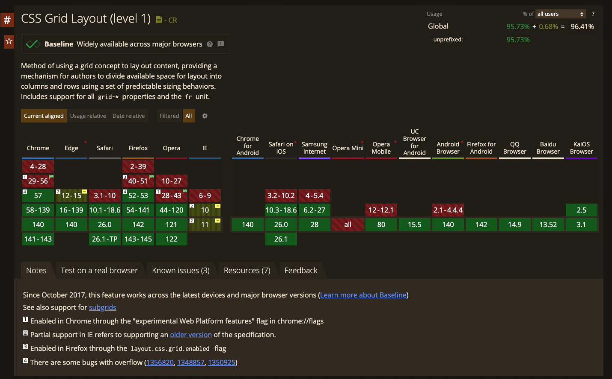
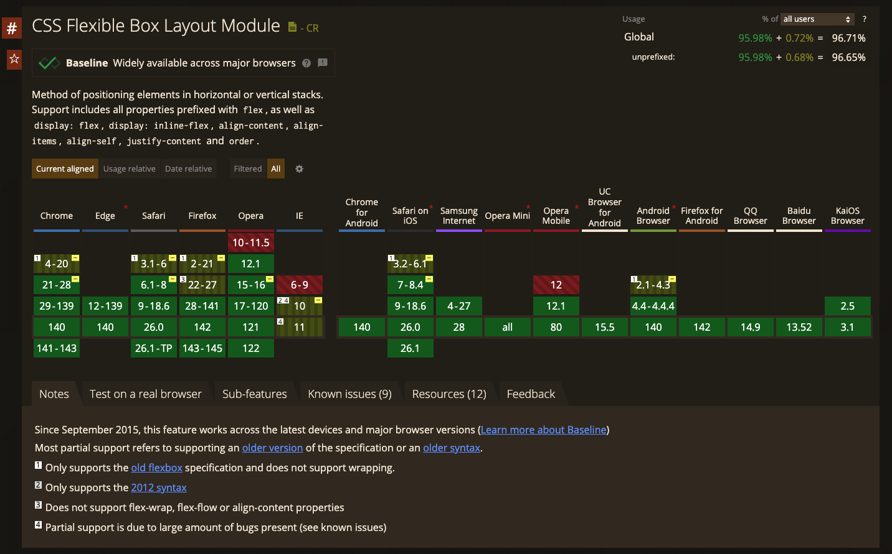
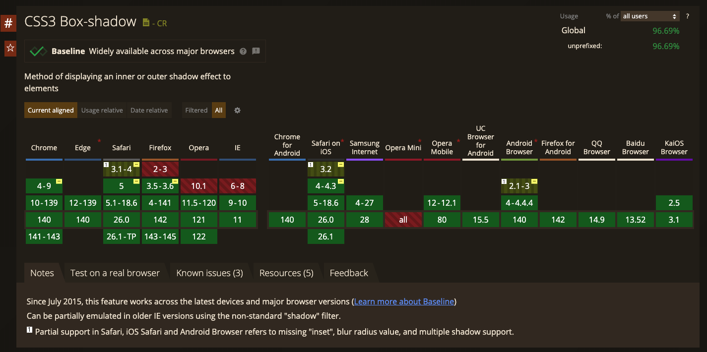
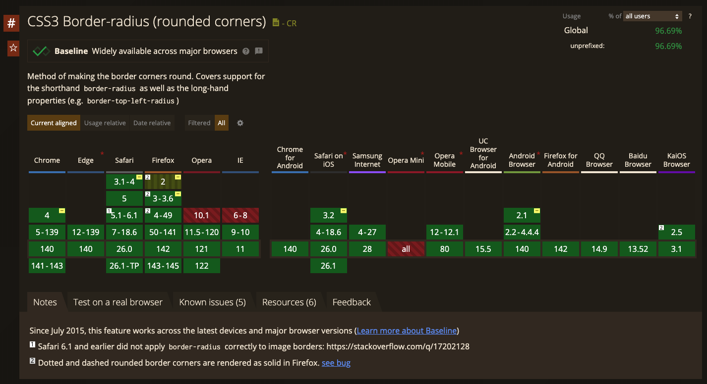

# Test Case 1: Compatibilidad Navegadores Desktop

## Objetivo
Verificar la correcta visualización y funcionalidad en navegadores desktop principales.

## Herramientas Utilizadas
- BrowserStack Live Testing
- Can I Use Database
- CSS Stats

## Navegadores Probados
| Navegador | Versión | OS | Resultado |
|-----------|---------|----|-----------|
| Chrome | 140 | Windows 11 | ✅ |
| Firefox | 142 | Windows 11 | ✅ |
| Safari | 17.3 | macOS | ✅ |
| Edge | 140 | Windows 11 | ✅ |

## Capturas de Pantalla
### Chrome

### Firefox

### Safari

### Edge

## Issues Encontrados
No se detectaron problemas de visualización ni de compatibilidad entre los diversos navegadores y sistemas operativos probados.

## Métricas de Compatibilidad (por navegador)

**Definición:**  
Se calcula en base al total de propiedades únicas de CSS detectadas con **CSS Stats** (`TotalProps`).  
Para cada navegador, se cuentan las propiedades soportadas según **Can I Use** (`CompatibleProps`).  

**Fórmula:**  
Compatibilidad CSS (por navegador) = (CompatibleProps / TotalProps) * 100

### Evidencias Requeridas
1. **Captura de CSS Stats** mostrando `TotalProps`.  
   

2. **Capturas de 4 propiedades consultadas en Can I Use** (una por imagen), indicando si están soportadas en cada navegador.   
     
     
     
     

### Tabla de Resultados
| Navegador | TotalProps | CompatibleProps | Compatibilidad CSS |
|-----------|------------|-----------------|---------------------|
| Chrome | 48 | 48 | 100% |
| Firefox | 48 | 48 | 100% |
| Safari | 48 | 48 | 100% |
| Edge | 48 | 48 | 100% |
