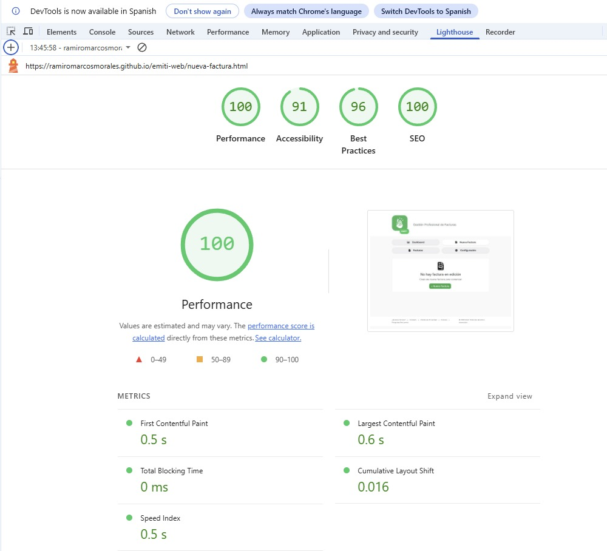
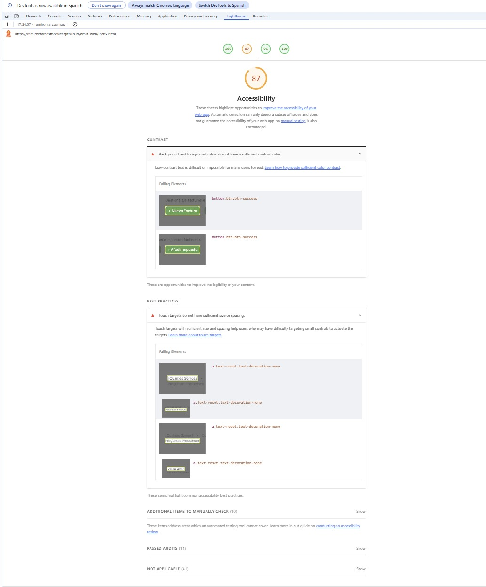

 # Test Case 11: Auditoría Lighthouse - Baseline Inicial 
 
 ## Información General 
 - **Fecha de ejecución:** 24/11/2025 
  - **URL testeada:** https://ramiromarcosmorales.github.io/emiti-web/nueva-factura.html
 - **Rama:** develop (antes de feature branches del parcial) 
 - **Navegador:** Chrome 142 (DevTools Lighthouse) 
 
 ## Umbrales Mínimos Definidos 
 - **Performance:** ≥ 80 
 - **Accessibility:** ≥ 90 
 - **Best Practices:** ≥ 85 
 - **SEO:** ≥ 80 
 
 ## Resultados Obtenidos 
 
 ### Performance: 100
 - First Contentful Paint: 0.5 s 
 - Largest Contentful Paint: 0.6s 
 - Total Blocking Time: 0 ms
 - Cumulative Layout Shift: 0.016 
 - Speed Index: 0.5 s   
  
 
 ### Accessibility: 91
 - Contraste insuficiente en boton entre texto y fondo
 - Touch targets pequeños, los enlaces del menu tienen tamaño/espaciado reducido    
  
 
 ### Best Practices: 96 
 - Los únicos puntos marcados estan relacionados con touch targets pequeños (coincide con accesibilidad)
 - No hay problemas criticos ni advertencias serias  
 
 ### SEO: 100 
 - La estructura de la página cumple con los requisitos básicos de SEO

 ## Issues Generadas 
 - [#130] Ajuste de contraste del boton principal e incrementar tamaño/espaciado de los links de navegacion 
 
 ## Conclusiones 
 El estado inicial del proyecto en nueva-factura.html es muy bueno:
- Performance perfecta (100) con tiempos de carga muy bajos.
- Accesibilidad sólida (91) pero con oportunidades claras de mejora en contraste y targets táctiles.
- Best Practices y SEO muy altos, sin problemas serios.
