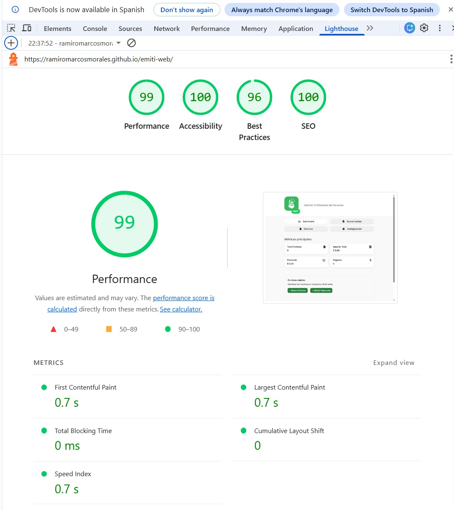
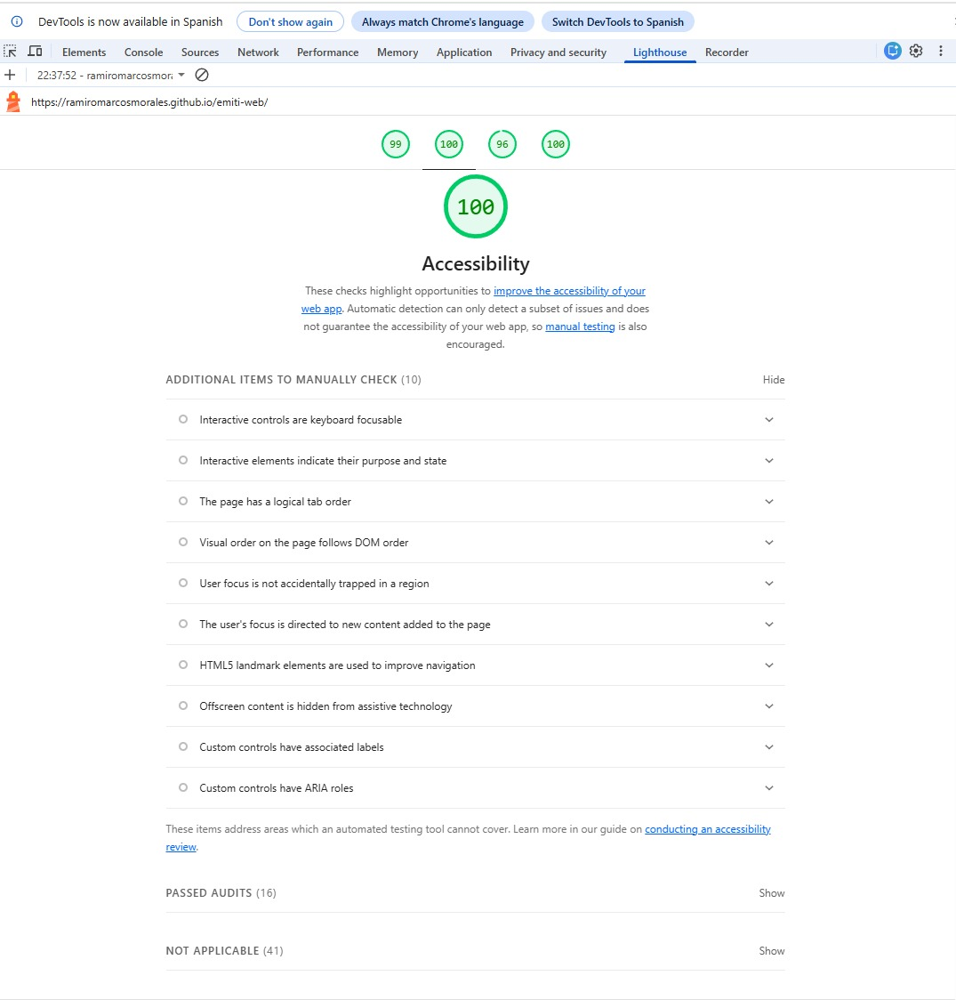

# Test Case 12: Auditoría Lighthouse - Post Fetch/API

## Información General
- **Fecha de ejecución:** 24/11/2025
- **URL testeada:** https://ramiromarcosmorales.github.io/emiti-web/
- **Rama:** develop (con feature/dev-async-fetch-api integrada)
- **Cambios implementados:**
- Consumo de API FakeStoreAPI con fetch
- Procesamiento asíncrono de datos
- Actualización dinámica del DOM

## Resultados Obtenidos

### Performance: 99
- First Contentful Paint: 0.7 s
- Largest Contentful Paint: 0.7 s
- Total Blocking Time: 0 ms
- Cumulative Layout Shift: 0
- Speed Index: 0.7 s

### Accessibility: 100
- No se detectarpn problemas de accesibilidad   

### Best Practices: 96
- Advertencia menor debido a que el logo assets/logo.png tiene menor resolucion que el tamaño al que se muestra

### SEO: 100
- No se registraron problemas

## Comparación con Baseline
| Métrica | Baseline | Post-Fetch | Diferencia |
|---------|----------|------------|------------|
| Performance | 100 | 99 | -1 ⚠️ |
| Accessibility | 87 | 100 | + 13 ✅ |
| Best Practices | 96 | 96 | 0 ✅ |
| SEO | 100 | 100 | 0 ✅ |

### Análisis de Impacto
- **Performance:** Se observa una minica caida (-1) esperable por llamadas asincronas. La integracion de la API no afecta negativamente la accesibilidad, SEO ni buenas practicas, que se mantienen en niveles optimos

- **Recomendaciones:**
- Implementar caché de respuestas API (opcional)

## Issues Generadas
No se generan issues ya que todas la metricas superan ampliamente los umbrales definidos

## Conclusiones
La integración de la API FakeStoreAPI mediante fetch fue exitosa y no produjo degradaciones significativas en el rendimiento.
El sistema mantiene métricas sobresalientes:
- Performance 99
- Accessibility 100
- Best Practices 96
- SEO 100
La aplicación continúa siendo rápida, accesible y estable, incluso incorporando lógica asincrónica y datos externos.