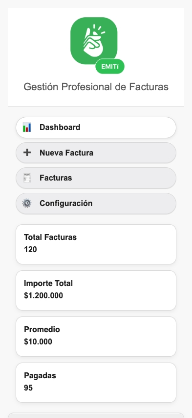
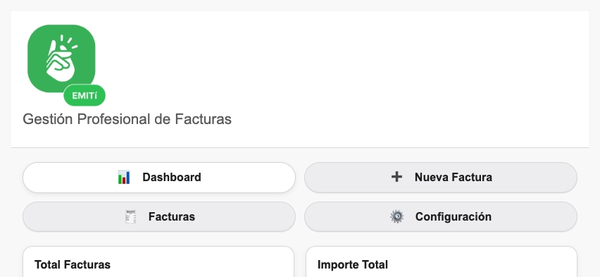
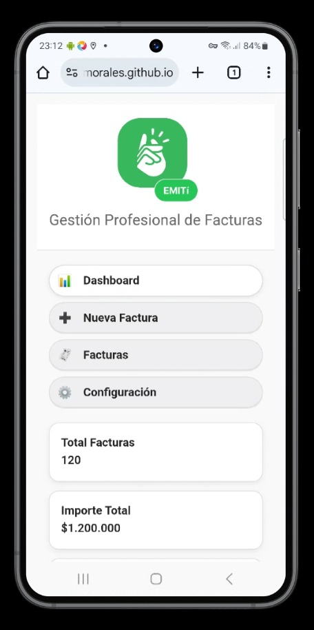
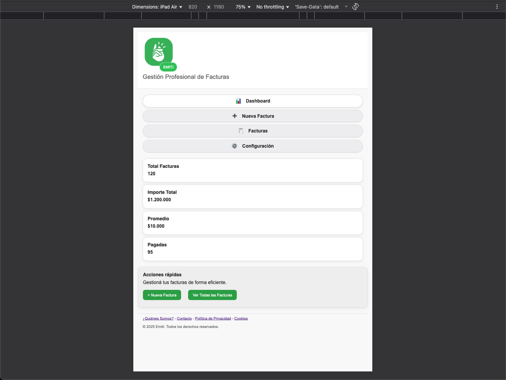
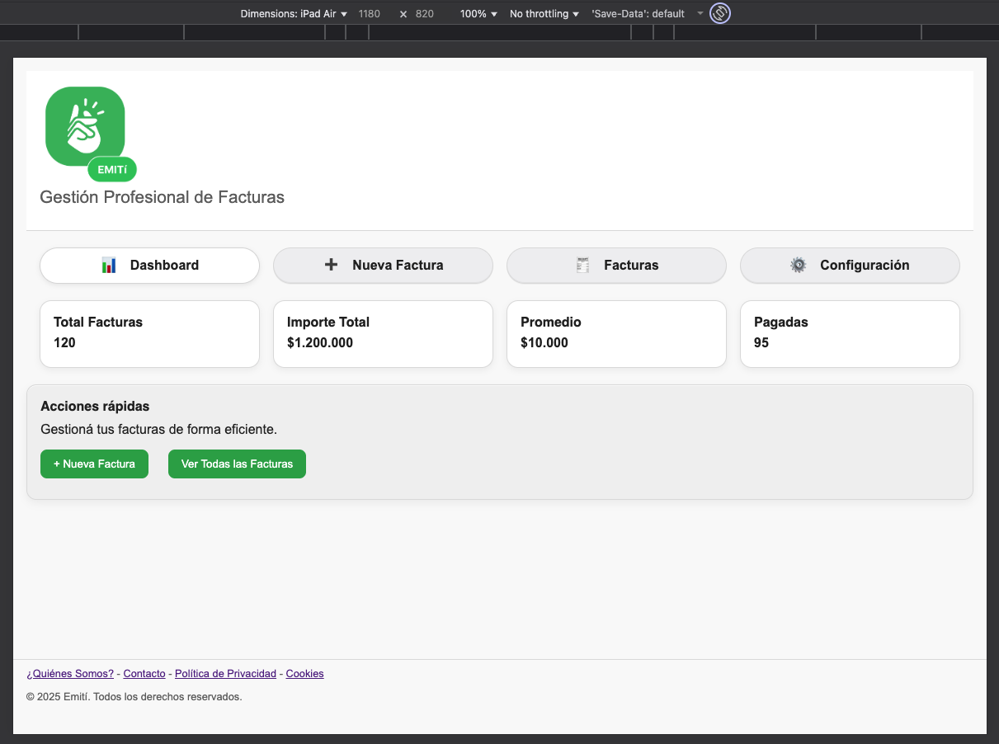

# Test Case 2: Testing Responsive Móviles

## Objetivo
Verificar la adaptabilidad responsive en dispositivos móviles reales

## Herramientas Utilizadas
- BrowserStack Real Device Testing
- Chrome DevTools Device Simulation
- Responsively App

## Dispositivos Probados
| Dispositivo | Resolución | Navegador | Orientación | Resultado |
|-------------|------------|-----------|-------------|-----------|
| iPhone 14 Pro | 393x852 | Safari | Portrait/Landscape | ✅ |
| Galaxy S23 | 360x780 | Chrome | Portrait/Landscape | ❌ |
| iPad Air | 820x1180 | Safari | Portrait/Landscape | ✅ |

## Breakpoints Verificados
- Mobile: 320px - 768px
- Tablet: 768px - 1024px
- Desktop: 1024px+

## Capturas por Dispositivo

### iPhone 14 Pro
- Portrait:  

- Landscape:  

### Galaxy S23
- Portrait:  

- Landscape:

### iPad Air
- Portrait:

- Landscape:

## Media Queries Validadas
- `@media (max-width: 600px)`: Validado en **iPhone 14 Pro (393x852)** y **Galaxy S23 (360x780)**
- `@media (min-width: 601px) and (max-width: 900px)`: Validado en **iPad Air (820x1180)**
- `@media (min-width: 901px)`: Validado en **Desktop (1280x800)**
- `@media (max-width: 900px) and (orientation: portrait)`: Validado en móviles
- `@media (max-width: 932px) and (orientation: landscape)`: Validado en **Galaxy S23 (360x780)**, el header ocupa mucha altura, propongo reducir el padding interno del header.
- `@media (min-width: 801px) and (max-width: 1024px) and (orientation: portrait)`: Validado en **iPad Air (820x1180)**