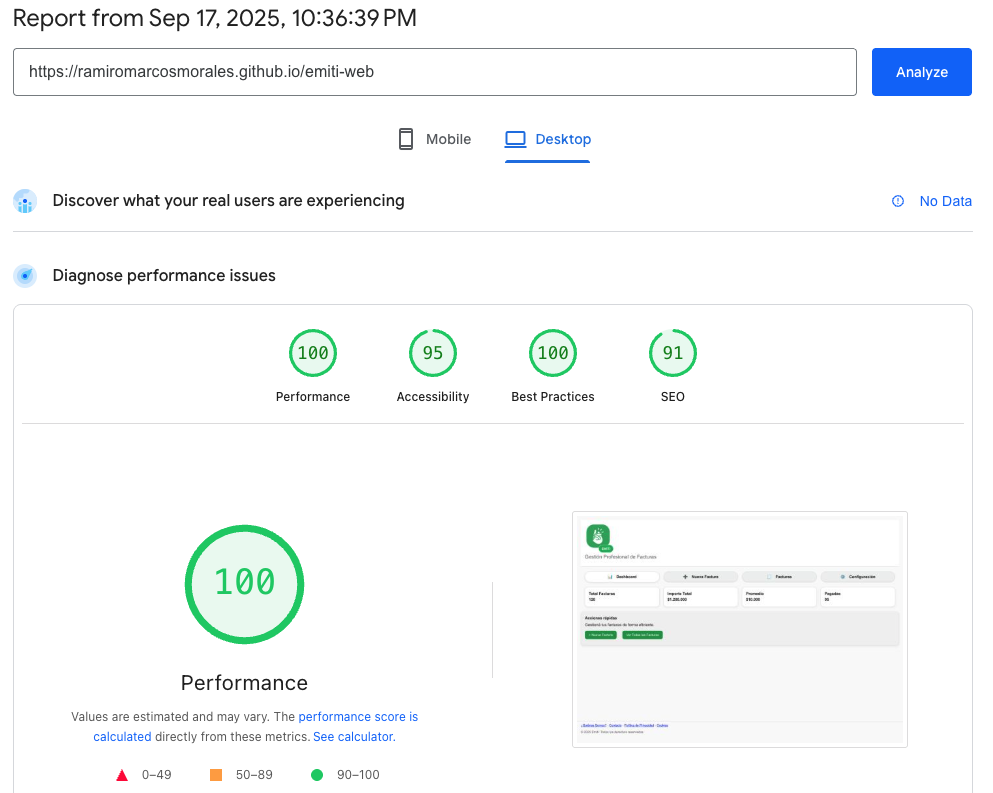
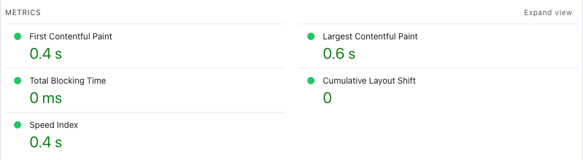
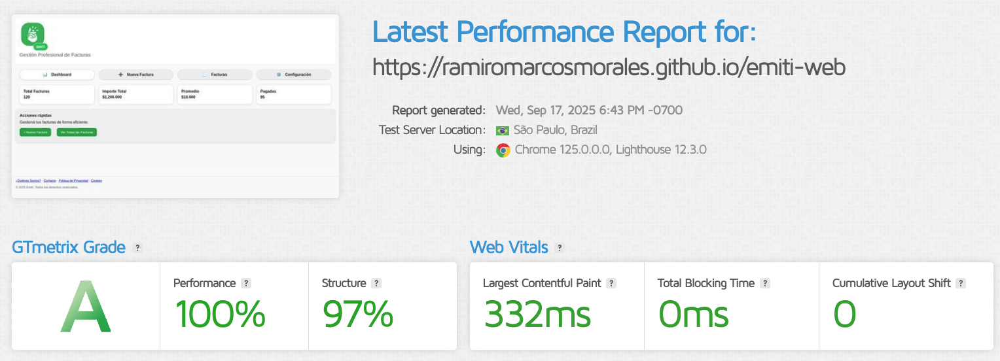
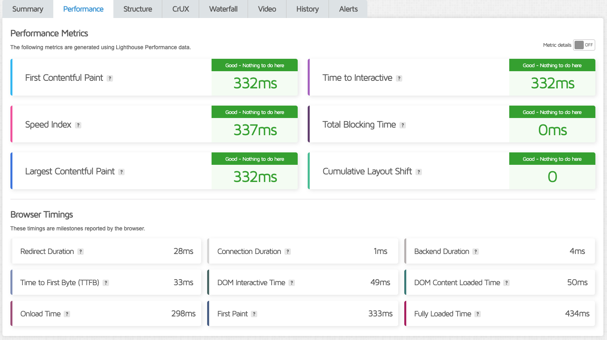
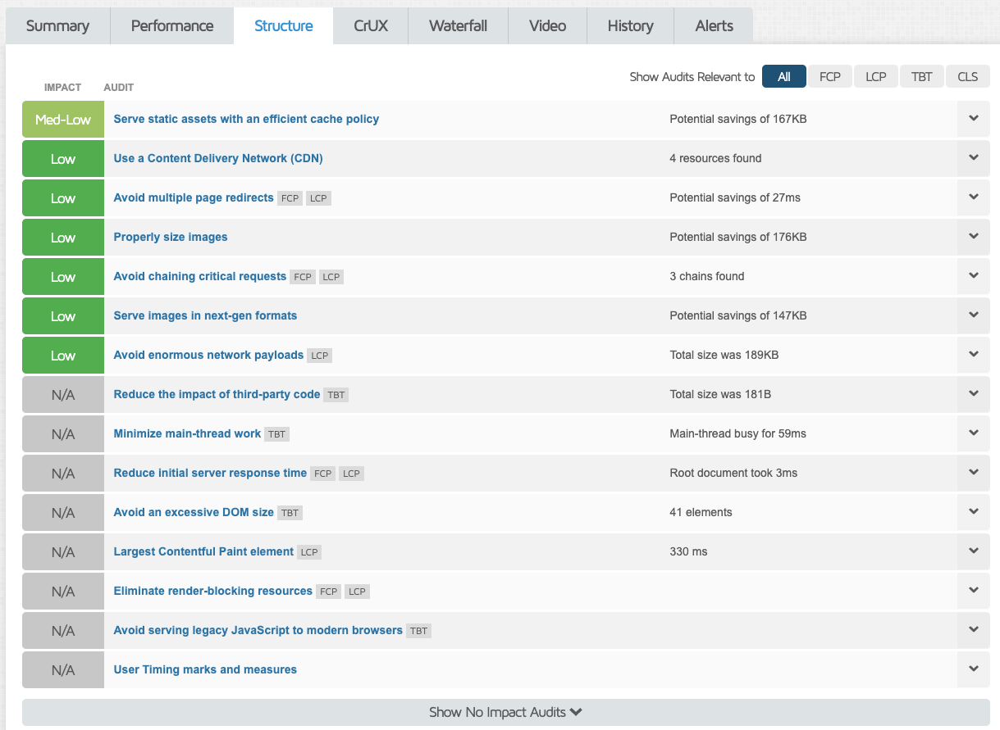
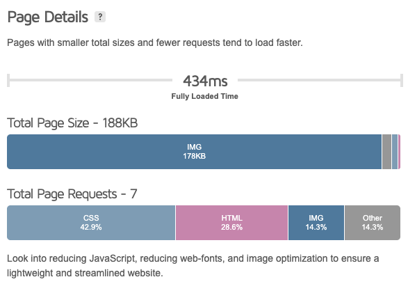
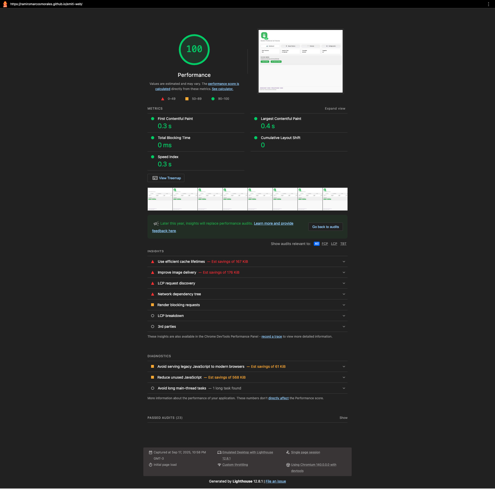

# Test Case 3: Performance y Velocidad de Carga

## Objetivo
Evaluar el rendimiento de la página en términos de velocidad de carga y métricas Core Web Vitals.

## Herramientas Utilizadas
- Google PageSpeed Insights
- GTmetrix
- Chrome DevTools Lighthouse

## Capturas Requeridas

1. **Google PageSpeed Insights**
   - Captura del puntaje de **Performance**:  
   
   - Captura de las métricas **FCP, LCP, CLS, FID**:
   

2. **GTmetrix**
   - Captura del **GTmetrix Grade**:
   
   - Captura de **Performance** y **Structure**:
   
   
   - Captura de **Fully Loaded Time** y **Page Size**:  
   

3. **Chrome DevTools Lighthouse**
   - Captura del **report completo**.
   - Mostrar claramente las métricas **Core Web Vitals**.
   - Indicar la versión de Chrome usada (opcional).
   

## Métricas Obtenidas

### Google PageSpeed Insights
- **Performance Score:** 100/100
- **First Contentful Paint (FCP):** 0.4s
- **Largest Contentful Paint (LCP):** 0.6s
- **Cumulative Layout Shift (CLS):** 0
- **First Input Delay (FID):** N/A

### GTmetrix Results
- **GTmetrix Grade:** A
- **Performance:** 100%
- **Structure:** 97%
- **Fully Loaded Time:** 434ms
- **Page Size:** 178KB

### Lighthouse Audit

## Optimizaciones Implementadas
- Logo optimizado: se redimensionó y optimizó el logo, logrando reducir el tamaño de 183KB a 7KB
- Font/CSS no bloquantes: mediante el uso de `rel="preload" as="style" onload="this.rel='stylesheet'"` + `<noscript>` en las etiquetas de importación de css se evita que el renderizado se bloquee.

## Comparativas Antes/Después
| Métrica         | Antes  | Después |
|-----------------|--------|---------|
| Performance     | 100/100| 100/100 |
| FCP             | 0.4s   | 0.5s |
| LCP             | 0.6s   | 0.5s |
| CLS             | 0      | 0.001 |
| Page Size       | 178KB  | 237KB |
| Fully Loaded    | 434ms  | 322ms |