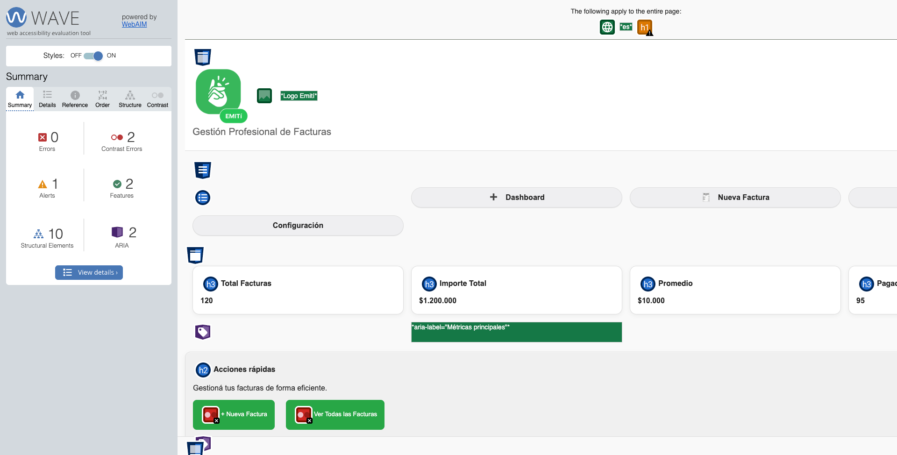
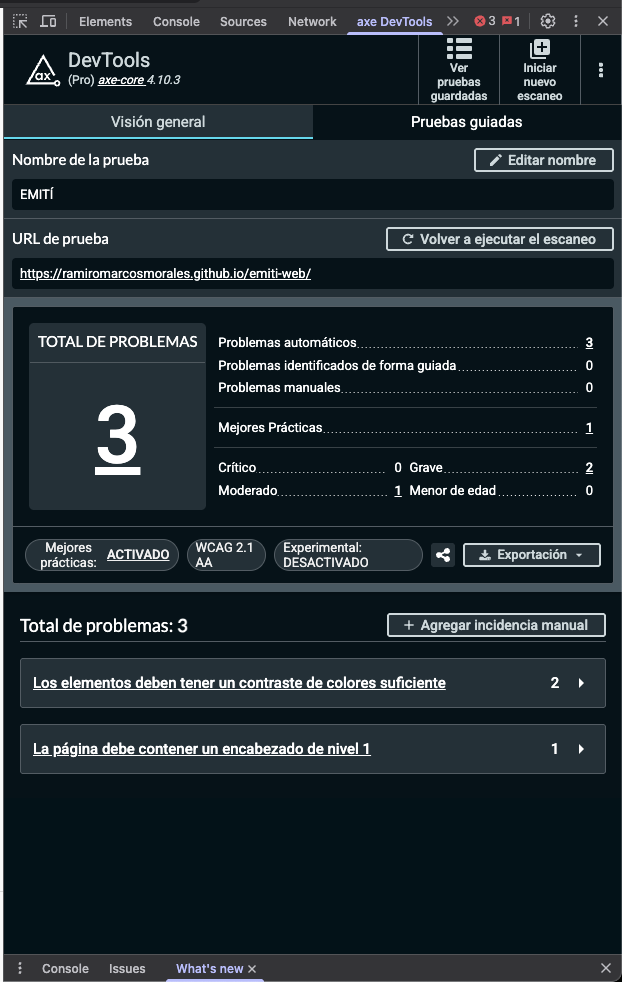
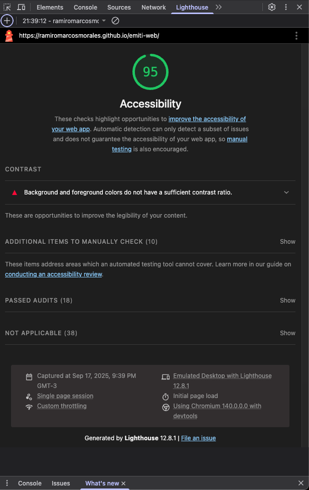

# Test Case 4: Accesibilidad Web (WCAG 2.1)

## Objetivo
Verificar el cumplimiento de estándares de accesibilidad WCAG 2.1 AA

## Herramientas Utilizadas
- WAVE Web Accessibility Evaluator
- axe DevTools Extension
- Lighthouse Accessibility Audit

## Resultados WAVE
- **Errores:** 0
- **Errores de Contraste:** 2
- **Alertas:** 1
- **Características:** 2
- **Elementos Estructurales:** 10
- **ARIA:** 2

### Captura WAVE Report

## Resultados axe DevTools
- **Violations:** 3
- **Needs Review:** 0
- **Passes:** N/A

### Captura Resultados axe DevTools

## Lighthouse Accessibility Score
- **Puntuación:** 95/100.  

## Tests Manuales Realizados
- ✅ Navegación completa por teclado
- ❌ Contraste de colores adecuado
- ✅ Texto alternativo en imágenes
- ✅ Etiquetas de formularios correctas
- ❌ Estructura semántica HTML

## Issues de Accesibilidad Encontrados
- **#1 - Encabezado de nivel 1**:

    Explicación: La página web no presenta un encabezado de nivel 1, incumpliendo la semántica de la página web.

    Solución: Reemplazar el elemento **p** "Gestión Profesional de Facturas" dentro del header a un **h1** para asegurar la semántica.

- **#2 - Contraste de Colores**:

    Explicación: El fondo de los elementos button situados dentro del div con la clase `acciones-botones` no constratan con el fondo del main.

    Solución: Ajustar el color de fondo de los botones a un tono más oscuro (ej. #2E7D32 - Verde más oscuro que pasa el contraste).