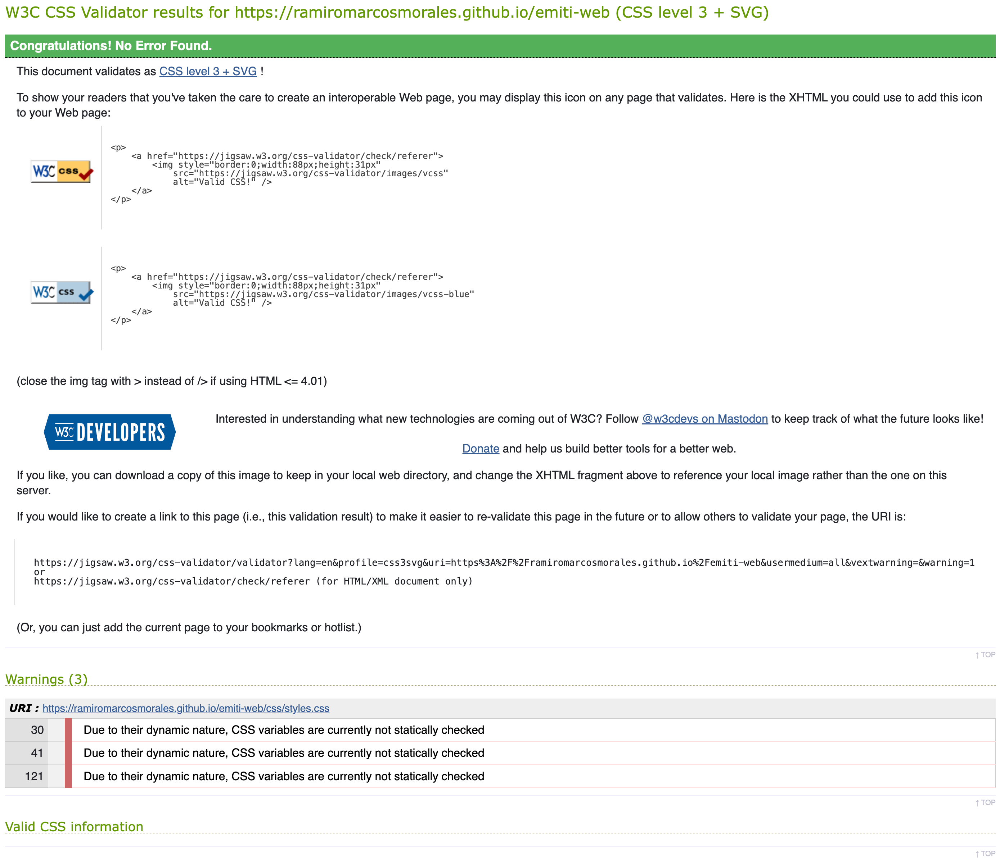
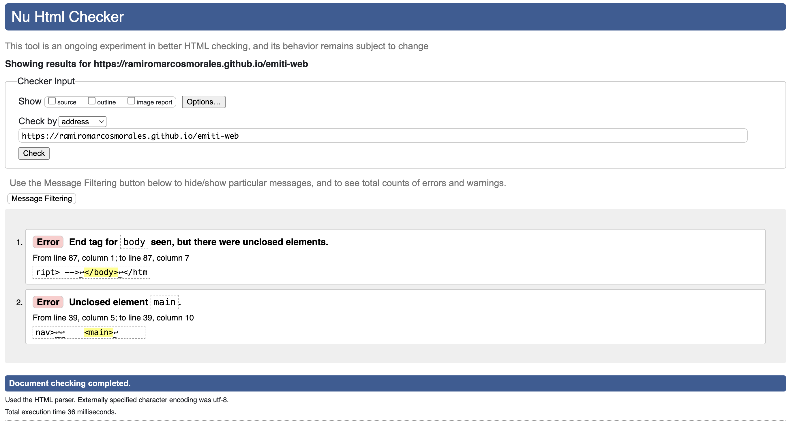

# Test Case 5: Cross-Platform y Validación CSS/HTML

## Objetivo
Verificar compatibilidad cross-platform y validar código CSS/HTML

## Herramientas Utilizadas
- LambdaTest Real Time Testing
- W3C CSS Validator
- W3C HTML Validator
- SauceLabs

## Testing Cross-Platform

### Windows 11
| Navegador | Versión | Resultado | Observaciones |
|-----------|---------|-----------|---------------|
| Chrome | 139 | ✅ | Renderizado correcto | 
| Firefox | 142 | ✅ | Renderizado correcto |
| Edge | 139 | ✅ | Renderizado correcto |

### macOS
| Navegador | Versión | Resultado | Observaciones |
|-----------|---------|-----------|---------------|
| Safari | 17 | ✅ | Renderizado correcto |
| Chrome | 139 | ✅ | Renderizado correcto |
| Firefox | 142 | ✅ | Renderizado correcto |

### Linux (Ubuntu)
| Navegador | Versión | Resultado | Observaciones |
|-----------|---------|-----------|---------------|
| Firefox | 143 | ✅ | Renderizado correcto |
| Chrome | 140 | ❌ | Renderizado incorrecto: emojis no se renderizan en Chrome. Fue resuelto. PR #54 |

## Validación W3C

### CSS Validation Results
- **CSS Validator:** ✅ Valid CSS
- **Warnings:** 3

### HTML Validation Results
- **HTML Validator:** ❌ 2 errores
- **Warnings:** 0

## Compatibilidad CSS Features
| Feature | Chrome | Firefox | Safari |
|-----------|------------|-----------------|---------------------|
| Grid | ✅ 57+ | ✅ 52+ | ✅ 10.1+ |
| Flexbox | ✅ 29+ | ✅ 28+ | ✅ 9+ |
| Box Shadow | ✅ 10+ | ✅ 4+ | ✅ 5.1+ |
| Border Radius | ✅ 5+ | ✅ 4+ | ✅ 5.1+ |