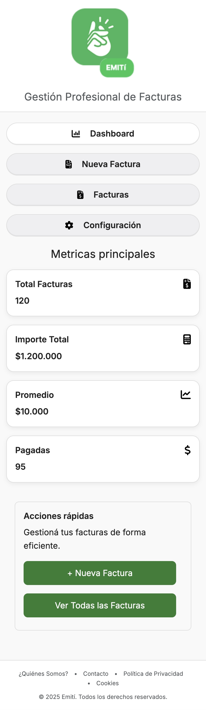

# Test Case 6: Responsive – Migración a Bootstrap

## Objetivo
Verificar la adaptabilidad responsive en dispositivos móviles, tablets y desktops tras la migración del proyecto a Bootstrap, asegurando que el diseño se mantenga coherente con el mockup `disenio-bootstrap.png`.

## Herramientas Utilizadas
- BrowserStack Real Device Testing
- Chrome DevTools Device Simulation
- Lighthouse / PageSpeed Insights
- ResponsivelyApp

## Dispositivos Probados
| Dispositivo   | Resolución | Navegador | Orientación         | Resultado |
|---------------|------------|-----------|---------------------|-----------|
| iPhone 14 Pro | 393x852    | Safari    | Portrait/Landscape  | ✅ |
| Galaxy S23    | 360x780    | Chrome    | Portrait/Landscape  | ✅ |
| iPad Air      | 820x1180   | Safari    | Portrait/Landscape  | ❌ |

## Breakpoints Verificados
- **Mobile:** 320px – 768px  
- **Tablet:** 768px – 1024px  
- **Desktop:** 1024px+  

## Capturas por Dispositivo
- Portrait:  

- Landscape:  

Ambos formatos coinciden con el mockup. ✅

### Galaxy S23
- Portrait:  

- Landscape:

Ambos formatos coinciden con el mockup. ✅

### iPad Air
- Portrait:

- Landscape:

Ambos formatos coinciden con el mockup. ✅

## Media Queries Validadas
- `[min-width: 320px]`  
- `[min-width: 768px]`  
- `[min-width: 1024px]`  
- Otras media queries personalizadas presentes en `responsive.css`.  

---

## Sistema de Grillas de Bootstrap
### Validaciones
- Verificar que las clases `col-`, `col-sm-`, `col-md-`, `col-lg-`, etc. se adapten correctamente en cada resolución.  
- Confirmar que no haya **scroll horizontal no deseado en mobile**.  

### Capturas esperadas
1. **Mobile (iPhone 14 Pro, ~393px ancho)**  
    

2. **Tablet (iPad Air, ~820px ancho)**  
     

3. **Desktop (>1024px)**  
    

---

## Performance en Mobile
### Validaciones
- Medir con **Lighthouse o PageSpeed** si no aumentó demasiado el tiempo de carga tras integrar Bootstrap.  
- Verificar el peso del **CSS cargado por CDN** y confirmar que no bloquee la renderización.  

### Capturas esperadas
1. **Reporte de Lighthouse / PageSpeed**  

  

## Comparativas Antes/Después
| Métrica         | Antes  | Después |
|-----------------|--------|---------|
| Performance     | 100/100| 100/100 |
| FCP             | 0.5s   | 0.6s |
| LCP             | 0.5s   | 0.6s |
| CLS             | 0.001  | 0 |
| Page Size       | 237KB  | 294KB |
| Fully Loaded    | 322ms  | 692ms |

2. **Detalle de recursos en Network (Chrome DevTools)**  

---

## Resultado Esperado
- El layout debe adaptarse correctamente en **mobile, tablet y desktop** sin pérdida de coherencia visual.  
- No debe existir **scroll horizontal inesperado** en mobile.  
- El impacto en **performance** debe ser mínimo y el CSS de Bootstrap debe cargarse correctamente desde el CDN.

----
## Issues encontrados
Durante la ejecución de este test se detectaron los siguientes problemas, documentados en el repositorio:  

| IssueID | Descripción 
|----|-------------|
| [#68](https://github.com/ramiromarcosmorales/emiti-web/issues/68) | Header y Footer no ocupan todo el ancho disponible