# Test Case 7: Responsive – Implementación de Componente Avanzado Bootstrap (1)

## Objetivo
Verificar la correcta integración, personalización visual y comportamiento responsive del modal “Nueva Factura” y del toast de confirmación verde en distintos dispositivos y navegadores, asegurando la coherencia visual y funcional del proyecto.
 

## Herramientas Utilizadas
- BrowserStack Mobile Testing  
- Chrome DevTools Device Mode  
- Google PageSpeed Insights 
- Lambdatest

## Dispositivos Probados
| Dispositivo       | Resolución | Navegador | Orientación         | Resultado |
|-------------------|------------|-----------|---------------------|-----------|
| iPhone 14 Pro     | 393x852    | Safari    | Portrait/Landscape  | ❌ |
| Galaxy S23        | 360x780    | Chrome    | Portrait/Landscape  | ✅ |
| iPad Air          | 820x1180   | Safari    | Portrait/Landscape  | ✅ |
| Desktop (Laptop)  | >1024px    | Chrome    | Landscape           | ✅ |

## Breakpoints Verificados
- **Mobile:** 320px – 768px  
- **Tablet:** 768px – 1024px  
- **Desktop:** 1024px+  

---

## Validaciones específicas
- Verificar que el componente se visualice correctamente en **mobile, tablet y desktop**.  
- Confirmar que **no se produzca scroll horizontal indeseado** en mobile.  
- Validar que la **interacción (clic/touch)** funcione correctamente en dispositivos táctiles.  
- Revisar que la personalización aplicada en `css/styles.css`, `css/components.css` y `css/bootstrap-overrides.css` mantenga la **identidad visual del proyecto**.  

---

## Capturas por Dispositivo

### iPhone 14 Pro
**Modal Nueva Factura – Portrait**
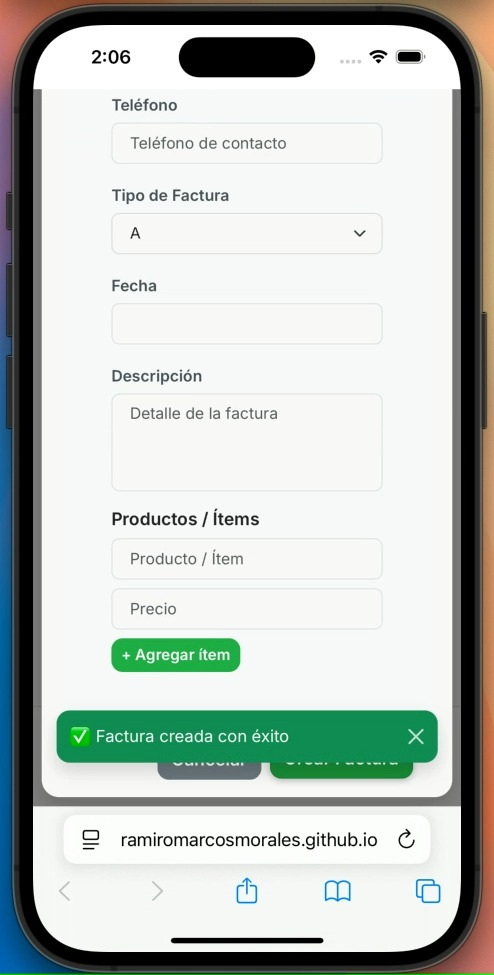

**Modal Nueva Factura – Landscape**
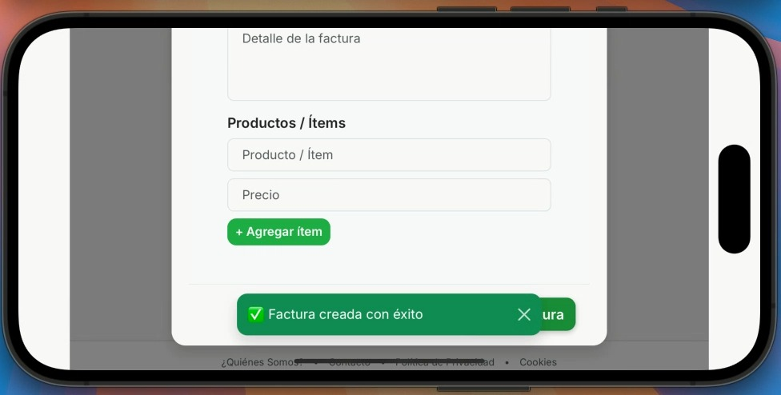

**Modal Añadir Impuesto – Portrait**

**Modal Añadir Impuesto – Landscape**

---

### Samsung Galaxy S23
**Modal Nueva Factura – Portrait**

**Modal Nueva Factura – Landscape**
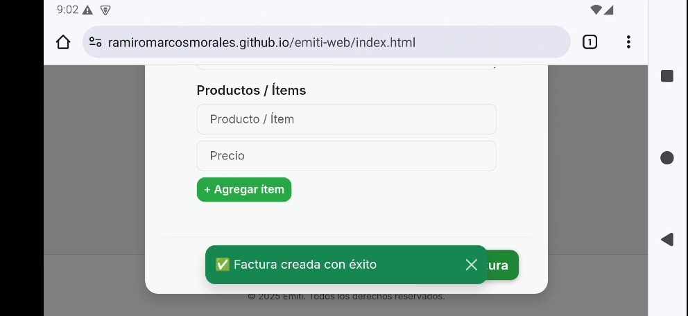

**Modal Añadir Impuesto – Portrait**

**Modal Añadir Impuesto – Landscape**

---

### iPad Air
**Modal Nueva Factura – Portrait**
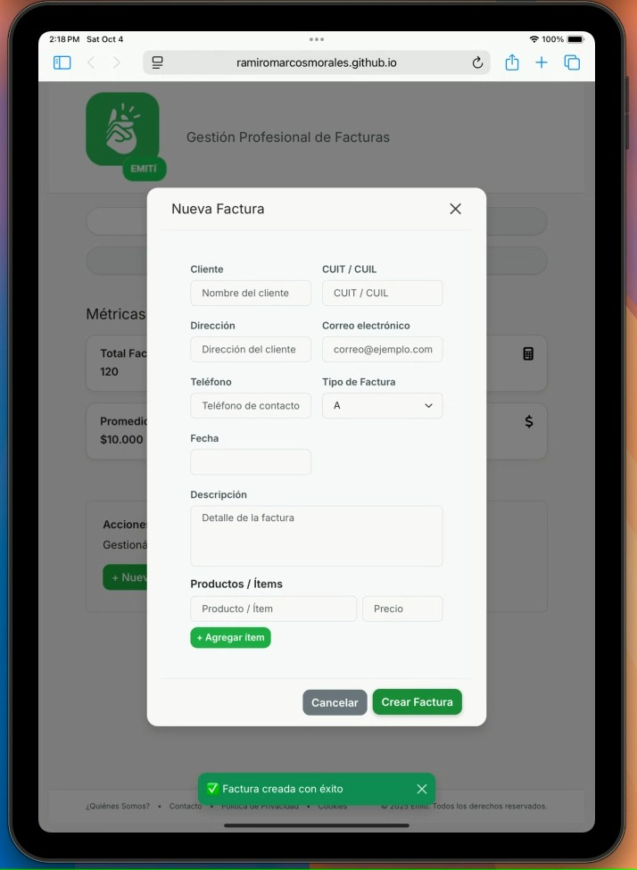

**Modal Nueva Factura – Landscape**
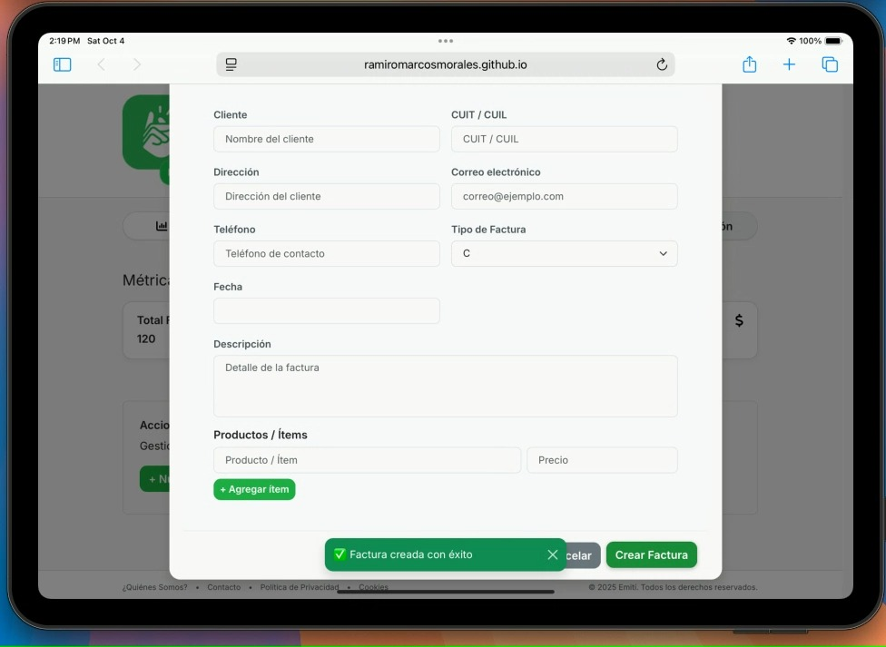

**Modal Añadir Impuesto – Portrait**
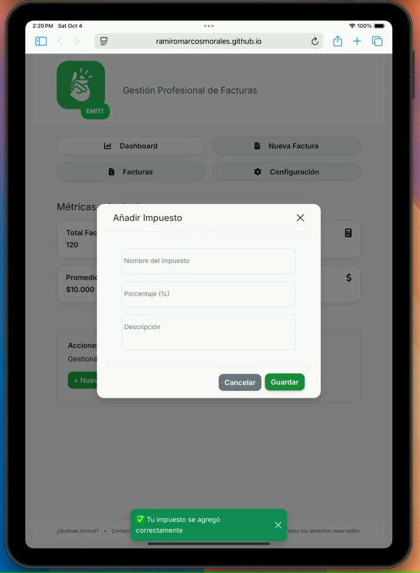

**Modal Añadir Impuesto – Landscape**

---

### Desktop
**Vista General Desktop**
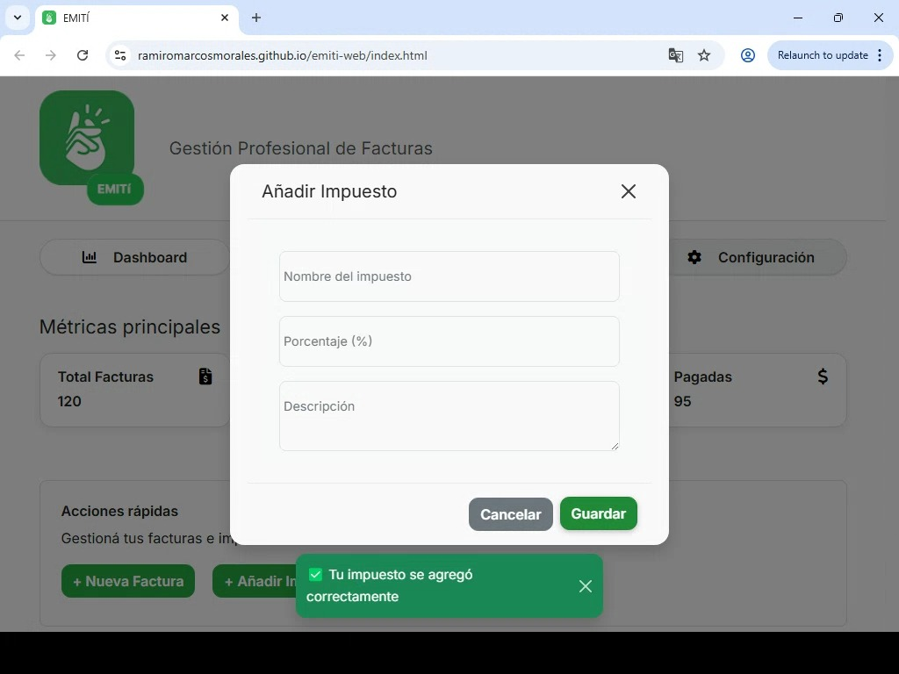

**Vista Nueva Factura**
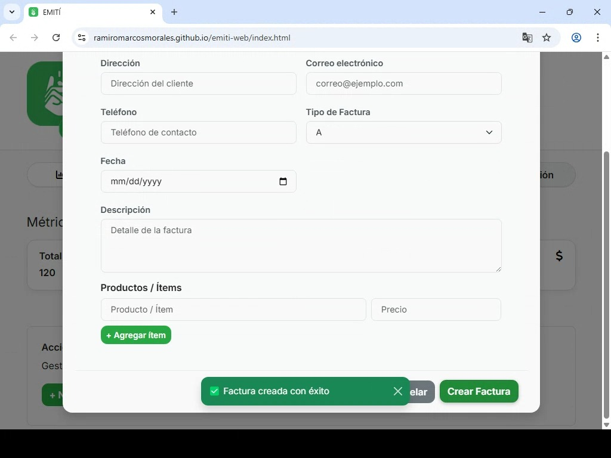

---

## DevTools → Performance & Network

### Performance Overview

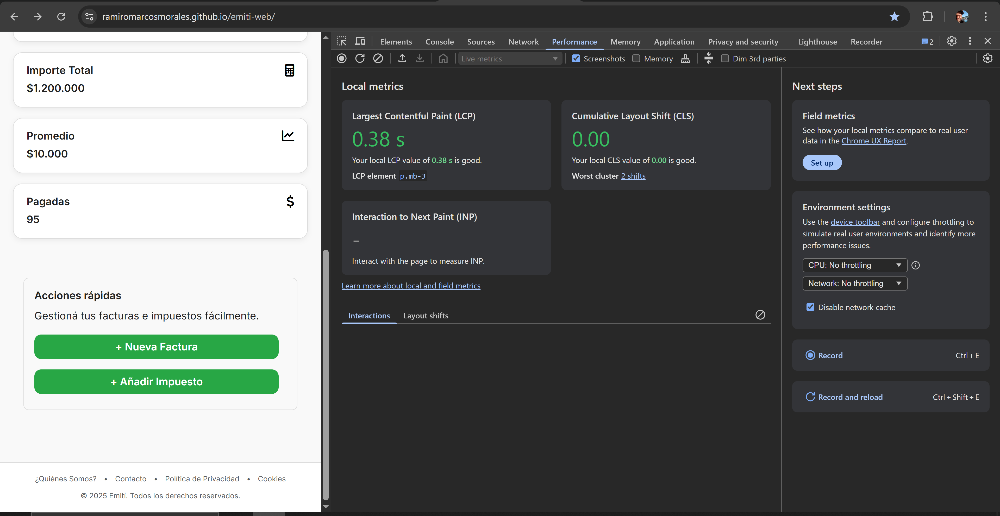

- **LCP (Largest Contentful Paint):** 0.42 s  
- **INP (Interaction to Next Paint):** 54 ms  
- **CLS (Cumulative Layout Shift):** 0.00  
- **Resultado general:** rendimiento estable y carga fluida del modal.

## Detalle de Recursos en Network
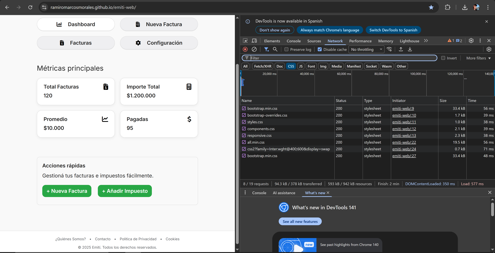

| Archivo | Tipo | Tamaño | Tiempo |
|----------|------|--------|--------|
| bootstrap.min.css | stylesheet | 33.4 kB | 47 ms |
| bootstrap-overrides.css | stylesheet | 1.7 kB | 38 ms |
| styles.css | stylesheet | 1.0 kB | 39 ms |
| components.css | stylesheet | 2.1 kB | 39 ms |
| responsive.css | stylesheet | 2.3 kB | 38 ms |

---

## Performance en Mobile
 **Reporte de PageSpeed**  

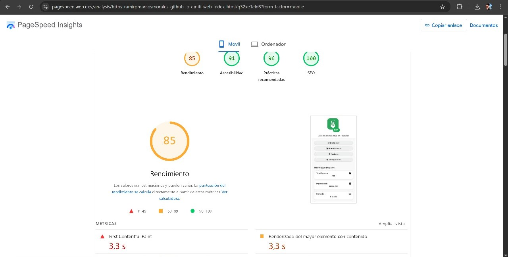  

| Métrica | Antes | Después |
|----------|--------|----------|
| Rendimiento (PageSpeed) | 85 | 87 |
| FCP | 0.5 s | 0.6 s |
| LCP | 0.5 s | 0.6 s |
| CLS | 0.001 | 0 |
| Tamaño de Página | 237 KB | 294 KB |
| Fully Loaded | 322 ms | 692 ms |

---

## Resultado Esperado
- El modal **se adapta correctamente** a todos los dispositivos y resoluciones.  
- Mantiene la **identidad visual** del proyecto.  
- No genera **bloqueos de carga** ni retrasa la renderización.  
- El **toast de confirmación** se muestra correctamente en verde tras guardar o añadir datos.

---

## Issues Encontrados
| IssueID | Descripción |
|----------|-------------|
| [#73](https://github.com/ramiromarcosmorales/emiti-web/issues/73) | Scroll leve en landscape de Iphone 14 Pro durante apertura de modal |

---