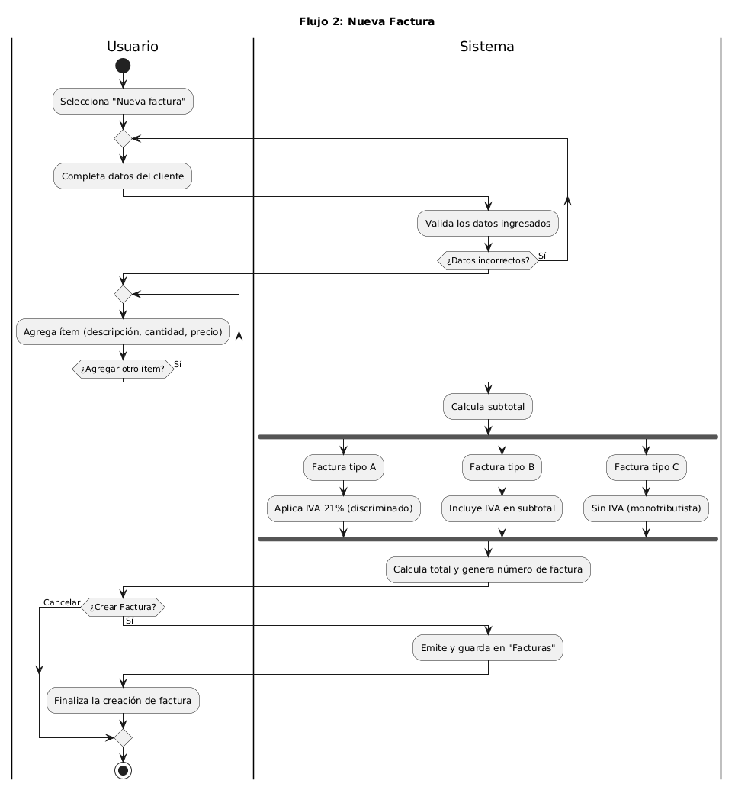
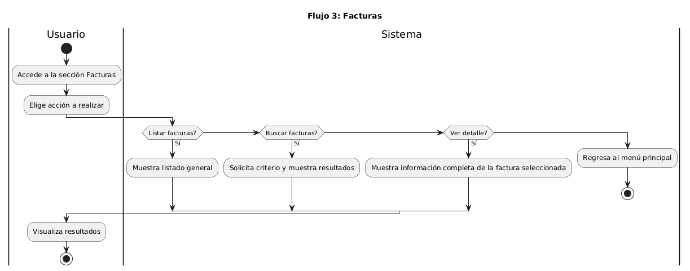

# Documentación de Diagramas de Actividad – Emití

Este documento reúne los 4 diagramas de actividades principales del sistema **Emití**, correspondientes a los flujos identificados en la lógica de negocio.  

---

## Índice

* [Flujo 1 – Dashboard](./actividad-flujo-1-dashboard.png)  
* [Flujo 2 – Nueva Factura](./actividad-flujo-2-nueva-factura.png)  
* [Flujo 3 – Facturas](./actividad-flujo-3-facturas.png)  
* [Flujo 4 – Configuración](./actividad-flujo-4-configuracion.png)

---

## Flujo 1 – Dashboard

**Descripción breve:**  
El usuario accede al Dashboard, donde el sistema obtiene todas las facturas desde el `dataStore`, calcula métricas generales (importe total, promedio, cantidad de facturas y pagadas) y muestra un resumen visual. Si no hay facturas, se presentan valores en cero.

**Archivo editable (.puml):**  
[`actividad-flujo-1-dashboard.puml`](./actividad-flujo-1-dashboard.puml)

**Vista previa (.png):**  

---

## Flujo 2 – Nueva Factura

**Descripción breve:**  
El usuario genera una nueva factura completando datos del cliente e ítems.  
El sistema valida los datos, calcula subtotales y totales según el tipo de factura:  
- **A:** IVA discriminado (21%)  
- **B:** IVA incluido  
- **C:** Sin IVA (monotributista)  
Finalmente, la factura se emite o se cancela según la decisión del usuario.

**Archivo editable (.puml):**  
[`actividad-flujo-2-nueva-factura.puml`](./actividad-flujo-2-nueva-factura.puml)

**Vista previa (.png):**  

---

## Flujo 3 – Facturas

**Descripción breve:**  
Representa las operaciones que puede realizar el usuario en la sección Facturas: listar, buscar o ver detalles.  
El sistema responde mostrando los resultados o mensajes según la acción seleccionada. Si no hay coincidencias o el usuario regresa, se vuelve al menú principal.

**Archivo editable (.puml):**  
[`actividad-flujo-3-facturas.puml`](./actividad-flujo-3-facturas.puml)

**Vista previa (.png):**  

---

## Flujo 4 – Configuración

**Descripción breve:**  
Permite al usuario acceder al módulo de Configuración, donde puede listar impuestos, agregar nuevos o utilizar la calculadora de IVA.  
Cada acción ejecuta procesos específicos del sistema, concluyendo con la actualización o visualización correspondiente.

**Archivo editable (.puml):**  
[`actividad-flujo-4-configuracion.puml`](./actividad-flujo-4-configuracion.puml)

**Vista previa (.png):**  

---

## Instrucciones para editar diagramas PlantUML

1. **Editor en línea:**  
   Podés usar [https://www.planttext.com/](https://www.planttext.com/) o [https://plantumleditor.com/](https://plantumleditor.com/) para abrir y modificar archivos `.puml`.

2. **Extensión de VSCode:**  
   - Instalar la extensión **PlantUML**.  
   - Asegurarse de tener **Java** y **Graphviz** instalados en el sistema.  
   - Abrir el archivo `.puml` y presionar `Alt + D` o `Ctrl + Shift + P` → “PlantUML: Preview Current Diagram”.

3. **Servidor PlantUML Online (render sin instalar nada):**  
   También podés usar el servidor oficial para visualizar el diagrama online.  
   https://www.plantuml.com/plantuml/uml/

   Pegá tu código PlantUML en el cuadro y el servidor generará la imagen automáticamente.

4. **Exportar a PNG:**  
   - En VSCode: clic derecho sobre el editor → *Export Current Diagram*.  
   - En PlantText: clic en *Save as Image* → elegir formato `.png`.
