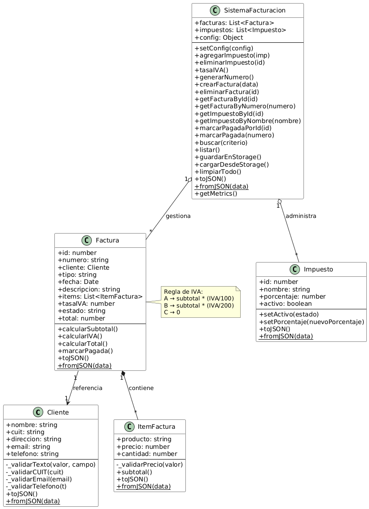

# Documentación – Diagrama de Clases

Este documento resume las clases del sistema **Emití**, su responsabilidad dentro del dominio y las relaciones modeladas en el diagrama de clases (PlantUML).

---

## Índice

* [Diagrama de Clases](./diagrama-clases.png)

---

## 1. Clases del Sistema

### **Cliente**
Modela los datos del cliente asociado a una factura.  
Valida nombre, CUIT, email, teléfono y dirección.  
Incluye serialización (`toJSON()` / `fromJSON()`).

### **ItemFactura**
Representa un producto o servicio dentro de la factura.  
Valida precio y cantidad.  
Calcula el subtotal y permite serialización.

### **Impuesto**
Modelo configurable de impuestos (ej. IVA).  
Guarda porcentaje y estado activo/inactivo.  
Permite modificaciones controladas.

### **Factura**
Entidad principal del sistema.  
Contiene cliente, ítems, tipo (A/B/C), totales y estado.  
Calcula subtotal, IVA y total según reglas del dominio.  
Controla marcado como pagada.

### **SistemaFacturacion**
Administra facturas e impuestos.  
Crea facturas, genera números correlativos, valida duplicados.  
Gestiona eliminación, búsqueda, métricas y serialización del sistema completo.

---

## 2. Relaciones entre Clases

### **Composición**
- `Factura *-- ItemFactura`  
  Los ítems existen únicamente dentro de una factura.

### **Asociación**
- `Factura --> Cliente`  
  Una factura referencia un cliente existente.

### **Agregación**
- `SistemaFacturacion o-- Factura`  
- `SistemaFacturacion o-- Impuesto`  
  El sistema gestiona colecciones de facturas e impuestos.

### **Multiplicidades**
- Factura tiene **1..*** ítems.  
- SistemaFacturacion puede tener **0..*** facturas e impuestos.  
- Cada factura tiene exactamente **1** cliente.

---

## 3. Justificación del Diseño

- Las clases encapsulan validaciones y lógica específica del dominio.  
- `Factura` concentra el cálculo de IVA y totales, evitando duplicación.  
- `SistemaFacturacion` actúa como punto central de coordinación.  
- Se usa composición, asociación y agregación según la naturaleza de los datos.  
- La serialización completa del sistema permite persistir el estado en `localStorage`.  
- El diseño es extensible sin romper la arquitectura (nuevos impuestos, métricas, etc.).

---

## 4. Vista previa del diagrama

