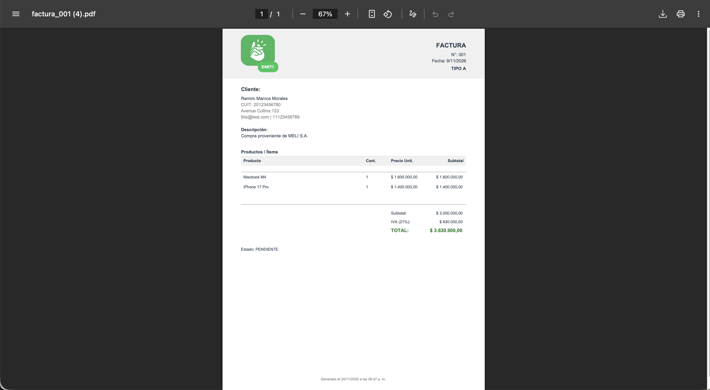

# Documentación de Librería Externa - jsPDF

## Información general
- **Nombre:** jsPDF
- **Versión:** 3.0.3
- **Autor:** James Hall
- **Repositorio:** https://github.com/parallax/jsPDF
- **Documentación:** https://raw.githack.com/MrRio/jsPDF/master/docs/index.html

## Propósito y Justificación
Se implementó con el propósito de generar el PDF de la factura.
En un principio, las facturas podían visualizarse, pero no existía una forma descargable. Esto dejaba incompleto el flujo de cualquier sistema de facturación.
La librería jsPDF permite generar documentos PDF desde el navegador sin necesidad de un backend. Esto aporta beneficios como:
- Completa funcionalidad crítica del sistema de facturación.
- Mejora la experiencia del usuario al poder descargar el documento.
- Alineada con el propósito del proyecto.

## Instalación e Integración
### Método utilizando CDN
```html
<script src="https://cdnjs.cloudflare.com/ajax/libs/jspdf/3.0.3/jspdf.umd.min.js"></script>
```

## Uso en el proyecto
### Caso de uso 1: Listado de facturas
Al acceder al listado de facturas, está disponible el botón para descargar el PDF de la factura.

```javascript
const btnDescargarPDF = document.getElementById("btnDescargarPDF");
btnDescargarPDF.addEventListener("click", () => {
  generarPDF(factura);
});
```

### Caso de uso 2: Detalles de una factura
Al acceder a los detalles de una factura, está disponible el botón para descargar el PDF de la factura.

```javascript
const btnDescargarPDF = document.getElementById("btnDescargarPDF");
btnDescargarPDF.addEventListener("click", () => {
  generarPDF(factura);
});
```

## Capturas de pantalla
