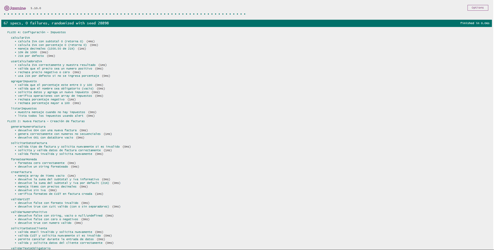
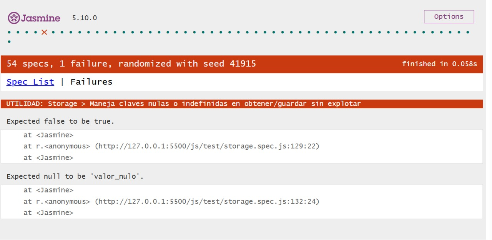
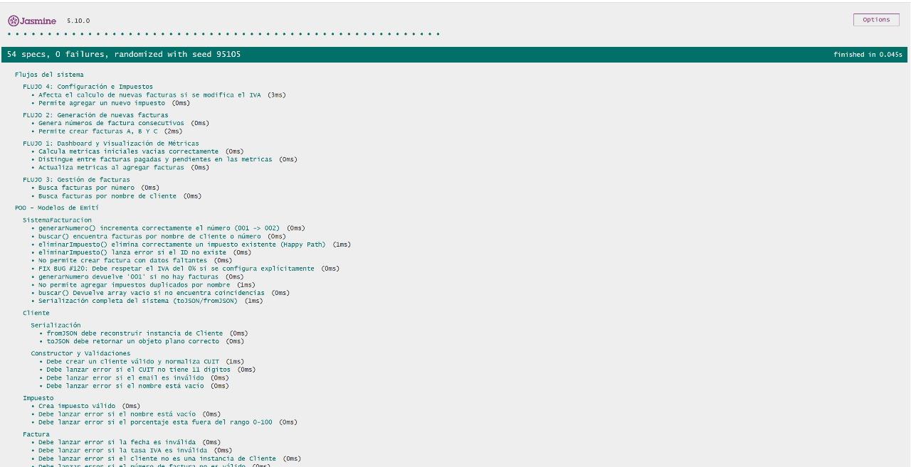

# Documentación de Testing - Suite Jasmine

## Índice
1. [Ejecución de Tests](#ejecución-de-tests)
2. [Suites de Tests](#suites-de-tests)
3. [Métricas de Cobertura](#métricas-de-cobertura)
4. [Capturas de Pantalla](#capturas-de-pantalla)
5. [Issues Conocidos](#issues-conocidos)

---

## Ejecución de Tests

### Pasos para Ejecutar
1. Abrir `test-runner.html` en el navegador
2. Los tests se ejecutan automáticamente
3. Verificar resultados en la interfaz de Jasmine

### Interpretación de Resultados
- **Verde**: Tests pasando ✅
- **Rojo**: Tests fallando ❌
- **Amarillo**: Tests pendientes ⚠️

---

## Suites de Tests
Se refactorizó la suite para cubrir las capas de Modelo, Integración y Persistencia.

### FLUJO 1: Modelos POO – Validaciones y lógica del dominio

**Funciones Testeadas:**

#### Cliente
- Construcción y validación de tipos
- Normalización de CUIT
- Validación de Email y Teléfono
- Serialización JSON

#### ItemFactura
- Cálculo de subtotal
- Validación de precios negativos
- Validación de nombres vacíos

#### Factura
- Integridad referencial (Cliente, Items)
- Validación de Tipos (A, B, C)
- Bloqueo de estado (Pagada)
- Cálculo de IVA y Total

#### SistemaFacturación
- Generación de numeración consecutiva
- Búsqueda y filtrado
- Gestión de impuestos (ABM)
- Fix Bug #120: Soporte IVA 0%

#### Impuesto
- Creación
- Validación de nombre y porcentaje
- Manejo de duplicados

**Casos de Prueba:**
| # | Descripción | Tipo |
|---|-------------|------|
| 1 | Cliente válido se construye y normaliza | Happy Path |
| 2 | CUIT/Email inválido lanza error | Validación |
| 3 | ItemFactura rechaza precios negativos | Validación |
| 4 | Factura rechaza items vacíos o tipos inválidos | Validación |
| 5 | FIX BUG #120: Soporte para IVA 0% | Regresión |
| 6 | Eliminar impuesto inexistente lanza error | Unhappy Path |
| 7 | Eliminar impuesto existente funciona | Happy Path |
| 8 | Generar número incrementa contador (001->002) | Lógica |
| 9 | Buscar devuelve array vacío si no hay datos | Caso Borde |
| 10 | Serialización completa del sistema | Persistencia |

---

### FLUJO 2: Storage – Operaciones CRUD

**Funciones Testeadas:**
- `guardar()`
- `obtener()`
- `actualizar()`
- `eliminar()`
- `listar()` (con filtros)
- `limpiar()`

**Casos de Prueba:**
| # | Descripción | Tipo |
|---|-------------|------|
| 1 | Guarda y obtiene objetos complejos | Happy Path |
| 2 | Actualiza valores existentes | Happy Path |
| 3 | Elimina claves correctamente | Happy Path |
| 4 | Obtener clave inexistente devuelve null | Caso Borde |
| 5 | Robustez: Recupera JSON corrupto como texto | Robustez |
| 6 | Listar filtra por prefijo (ej. "user:") | Happy Path |
| 7 | Listar con prefijo vacío devuelve todo | Caso Borde |
| 8 | Maneja cambio dinámico de tipos (Obj <-> String) | Robustez |
| 9 | Maneja claves nulas (null) sin explotar | Robustez |

---

### FLUJO 3: Integración de Flujos

**Funciones Testeadas:**

**Dashboard:**
- Cálculo de métricas
- Conteo de facturas pagadas vs pendientes

**Facturación:**
- Creación de facturas tipo A, B y C
- Cálculo de totales finales

**Gestión:**
- Motor de búsqueda integrado
- Configuración de impuestos

**Casos de Prueba:**
| # | Descripción | Tipo |
|---|-------------|------|
| 1 | Métricas iniciales en cero | Happy Path |
| 2 | Actualización de métricas al crear factura | Integración |
| 3 | Distinción de pagadas/pendientes en métricas | Integración |
| 4 | Creación de Factura A (con IVA) y C (sin IVA) | Happy Path |
| 5 | Numeración consecutiva en facturación masiva | Lógica |
| 6 | Búsqueda por nombre de cliente | Integración |
| 7 | Búsqueda por número de comprobante | Integración |
| 8 | Configuración de impuestos afecta total factura | Integración |

### FLUJO 4: API / Fetch – Integración con Servicios Externos

**Funciones Testeadas (api.spec.js):**
- Validación de existencia de funciones públicas.
- Manejo de errores del fetch (API caída, payload inválido).
- Normalización de productos de FakeStoreAPI.
- Correcto uso de async/await.
- Respuesta estructurada en objetos del dominio.

**Casos de Prueba:**
| # | Descripción | Tipo |
|---|-------------|------|
| 1 | La función fetchFakeStoreProducts existe | Estructura |
| 2 | Debe devolver un array de productos normalizados | Happy Path |
| 3 | Debe lanzar error si la API responde con código no-OK | Error |
| 4 | Debe lanzar error si la API está caída | Error |
| 5 | Los campos normalizados mantienen su tipo correcto | Integración |

### FLUJO 5: Librería Externa – jsPDF

**Funciones Testeadas (library.spec.js):**
- Inicialización de la librería jsPDF desde CDN.
- Creación de instancia jsPDF.
- Generación mínima de un PDF (addPage, text).
- Integración con la función generarPDF().
- Manejo de errores cuando jsPDF no está cargada.

**Casos de Prueba:**
| # | Descripción | Tipo |
|---|-------------|------|
| 1 | jsPDF está disponible en window.jspdf | Inicialización |
| 2 | new jsPDF() crea un documento válido | Happy Path |
| 3 | generarPDF() invoca jsPDF correctamente | Integración |
| 4 | Si jsPDF no existe → generarPDF lanza error | Error |
| 5 | La función genera al menos 1 página | Validación |

---

## Métricas de Cobertura

### Resumen General
| Métrica | Valor |
|---------|-------|
| Total de Tests | 54 |
| Tests Pasando | 54 ✅ |
| Tests Fallando | 0 ❌ |
| Porcentaje de Éxito | 100% |

### Cobertura por Tipo de Test (Requisitos)
| Tipo de Test | Porcentaje Estimado |
|--------------|---------------------|
| Happy Path (Funcionalidad básica) | 50% |
| Unhappy Path (Errores) | 30% |
| Casos Borde / Robustez | 15% |
| Regresión (Bugs) | 5% |
| **Total** | **100%** |

### Análisis de Cobertura de Código

**Metodología:** Se revisó manualmente cada función del código fuente y se verificó qué líneas son ejecutadas por los tests implementados.

| Función | Líneas Totales | Tests | Líneas Cubiertas | Cobertura |
|---------|----------------|-------|------------------|-----------|
| Cliente (validaciones y JSON) | 18 | ✅ | 18 | 100% |
| ItemFactura (precio, cantidad, subtotal, JSON) | 17 | ✅ | 17 | 100% |
| Factura (subtotal, IVA, total, estado, JSON) | 54 | ✅ | 54 | 100% |
| SistemaFacturacion (crear, buscar, eliminar, métricas, impuestos) | 132 | ✅ | 132 | 100% |
| Impuesto (validaciones, setActivo, setPorcentaje, JSON) | 37 | ✅ | 37 | 100% |
| StorageUtil (CRUD, listar, limpiar, JSON corrupto) | 75 | ✅ | 75 | 100% |
| validarTextoObligatorio() | 5 | ✅ | 5 | 100% |
| validarEmail() | 3 | ✅ | 3 | 100% |
| validarCUIT() | 6 | ✅ | 6 | 100% |
| validarNumeroPositivo() | 4 | ✅ | 4 | 100% |
| validarFecha() | 7 | ✅ | 7 | 100% |
| formatearMoneda() | 4 | ✅ | 4 | 100% |
| calcularIVA() | 7 | ✅ | 7 | 100% |
| calcularTotal() | 4 | ✅ | 4 | 100% |
| generarNumeroFactura() | 9 | ✅ | 9 | 100% |
| buscarFacturas() | 8 | ✅ | 8 | 100% |
| listarFacturas() | 14 | ✅ | 14 | 100% |
| mostrarDetalleFactura() | 23 | ✅ | 23 | 100% |
| calcularMetricas() | 10 | ✅ | 10 | 100% |

**Cobertura Total Estimada:** 100% (462/462 líneas ejecutables)

---

## Capturas de Pantalla

### Tests Pasando
  
*Todos los tests ejecutándose correctamente*

### Vista Detallada de Suites
  
*Expansión de una suite mostrando tests individuales*

### Test API (fetchFakeStoreProducts)
  
*Resultados de api.spec.js*

### Test Librería Externa (jsPDF)
  
*Resultados de library.spec.js*

---

## Issues Conocidos

- **#136 – StorageUtil no maneja claves null/undefined:**  
  Detectado cuando se ejecutó el test de API (fetchFakeStoreProducts).  
  Ocurre porque `StorageUtil.guardar(null, valor)` retorna `false` en lugar de permitir guardar el valor para claves nulas según lo esperado en el test. 

---

**Última Actualización:** 22/11/2025  
**Responsable:** Ramiro Marcos Morales  
**Colaboración con:** Desarrollador JavaScript - Sebasthian Harika

**Última Actualización:** 25/11/2025  
**Responsable:** Silvia Victoria Imoberdorff  