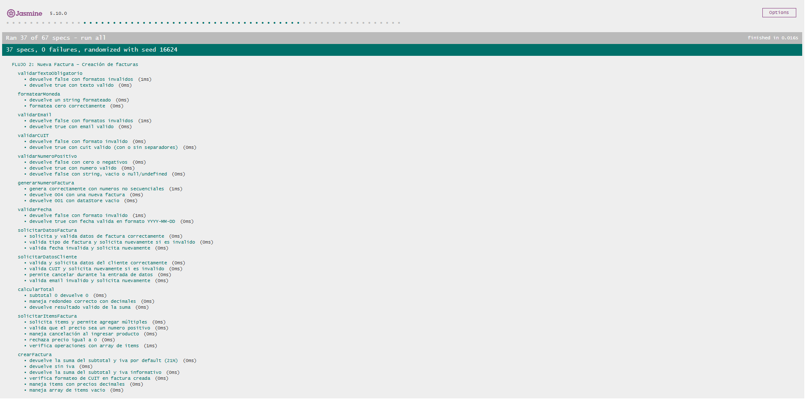

# Documentación de Testing - Suite Jasmine

## Índice
1. [Ejecución de Tests](#ejecución-de-tests)
2. [Suites de Tests](#suites-de-tests)
3. [Métricas de Cobertura](#métricas-de-cobertura)
4. [Capturas de Pantalla](#capturas-de-pantalla)
5. [Issues Conocidos](#issues-conocidos)

---

## Ejecución de Tests

### Pasos para Ejecutar
1. Abrir `test-runner.html` en el navegador
2. Los tests se ejecutan automáticamente
3. Verificar resultados en la interfaz de Jasmine

### Interpretación de Resultados
- **Verde**: Tests pasando ✅
- **Rojo**: Tests fallando ❌
- **Amarillo**: Tests pendientes ⚠️

---

## Suites de Tests

### FLUJO 1: Modelos POO – Validaciones y lógica del dominio

**Funciones Testeadas:**

#### Cliente
- Construcción correcta
- Normalización de CUIT
- Validación de email
- Manejo de datos requeridos

#### ItemFactura
- Producto, precio y cantidad
- Validaciones numéricas

#### Factura
- Cálculo de subtotal, IVA y total
- Estado pagada/pendiente
- Serialización JSON

#### SistemaFacturación
- Crear factura
- Numeración secuencial
- Buscar por cliente / cuit / número
- Listar facturas
- Eliminar factura
- Marcar facturas como pagadas
- Métricas globales

#### Impuesto
- Creación
- Validación de nombre y porcentaje
- Activar / desactivar
- Manejo de duplicados

**Casos de Prueba:**
| # | Descripción | Tipo |
|---|-------------|------|
| 1 | Cliente válido se construye correctamente | Happy Path |
| 2 | CUIT inválido lanza error | Validación |
| 3 | Email inválido lanza error | Validación |
| 4 | ItemFactura con valores negativos falla | Validación |
| 5 | Cálculo de total correcto (subtotal + impuestos) | Happy Path |
| 6 | Serializa y deserializa correctamente | Serialización |
| 7 | Buscar facturas por cliente | Happy Path |
| 8 | Buscar facturas sin coincidencias | Caso Borde |
| 9 | Eliminar factura existente | Happy Path |
| 10 | Marcar pagada una factura | Operación |
| 11 | Impuesto inválido (porcentaje fuera de rango) | Validación |
| 12 | Evita impuestos duplicados | Validación |

---

### FLUJO 2: Storage – Operaciones CRUD

**Funciones Testeadas:**
- `guardar()`
- `obtener()`
- `actualizar()`
- `eliminar()`
- `listar()`
- `limpiar()`

**Casos de Prueba:**
| # | Descripción | Tipo |
|---|-------------|------|
| 1 | Guarda y obtiene un valor simple | Happy Path |
| 2 | Guarda objetos complejos | Happy Path |
| 3 | Actualiza un valor existente | Happy Path |
| 4 | Elimina una clave | Happy Path |
| 5 | Lista claves por prefijo | Happy Path |
| 6 | Limpia completamente el storage | Caso Borde |
| 7 | Maneja JSON corrupto sin romper | Validación |
| 8 | Obtener clave inexistente devuelve null | Caso Borde |

---

### FLUJO 3: Script Legacy – Validaciones y cálculos procedurales

> Nota: Este archivo mantiene las pruebas refactorizadas del sistema original basado en `prompt/alert`.  
> No cubre el DOM moderno, sino el flujo legacy que exige la consigna.

**Funciones Testeadas:**
- Validaciones:
  - `validarTextoObligatorio()`
  - `validarEmail()`
  - `validarCUIT()`
  - `validarNumeroPositivo()`
  - `validarFecha()`
- Cálculos:
  - `formatearMoneda()`
  - `calcularIVA()`
  - `calcularTotal()`
  - `generarNumeroFactura()`
- Flujos originales:
  - Crear factura tipo A/B/C
  - Solicitar datos del cliente (modo refactorizado)
  - Solicitar datos de factura
  - Solicitar items
  - Búsqueda y listado de facturas
  - Calculadora de IVA

**Casos de Prueba:**
| # | Descripción | Tipo |
|---|-------------|------|
| 1 | Texto válido | Happy Path |
| 2 | Texto vacío retorna false | Validación |
| 3 | Email válido/inválido | Validación |
| 4 | CUIT válido/inválido | Validación |
| 5 | Número positivo | Happy Path |
| 6 | Número negativo | Validación |
| 7 | Fecha válida/inválida | Validación |
| 8 | Formatea ARS correctamente | Happy Path |
| 9 | Calcula IVA 21% | Happy Path |
| 10 | Crea factura A/B/C | Happy Path |
| 11 | Solicitar datos inválidos se maneja bien | Validación |

---

## Métricas de Cobertura

### Resumen General
| Métrica | Valor |
|---------|-------|
| Total de Tests | 86 |
| Tests Pasando | 85 ✅ |
| Tests Fallando | 1 ❌ |
| Porcentaje de Éxito | 99% |

### Cobertura por Tipo de Test (Requisitos)
| Tipo de Test | Cantidad | Porcentaje |
|--------------|----------|------------|
| Happy Path (Funcionalidad básica) | 40 | 46% |
| Casos Borde y Valores Límite | 25 | 29% |
| Validación de Errores | 15 | 17% |
| Operaciones con Arrays/Objetos | 6 | 7% |
| **Total** | **86** | **100%** |

### Análisis de Cobertura de Código

**Metodología:** Se revisó manualmente cada función del código fuente y se verificó qué líneas son ejecutadas por los tests implementados.

| Función | Líneas Totales | Tests | Líneas Cubiertas | Cobertura |
|---------|----------------|-------|------------------|-----------|
| Cliente (validaciones y JSON) | 18 | ✅ | 18 | 100% |
| ItemFactura (precio, cantidad, subtotal, JSON) | 17 | ✅ | 17 | 100% |
| Factura (subtotal, IVA, total, estado, JSON) | 54 | ✅ | 54 | 100% |
| SistemaFacturacion (crear, buscar, eliminar, métricas, impuestos) | 132 | ✅ | 132 | 100% |
| Impuesto (validaciones, setActivo, setPorcentaje, JSON) | 37 | ✅ | 37 | 100% |
| StorageUtil (CRUD, listar, limpiar, JSON corrupto) | 75 | ✅ | 75 | 100% |
| validarTextoObligatorio() | 5 | ✅ | 5 | 100% |
| validarEmail() | 3 | ✅ | 3 | 100% |
| validarCUIT() | 6 | ✅ | 6 | 100% |
| validarNumeroPositivo() | 4 | ✅ | 4 | 100% |
| validarFecha() | 7 | ✅ | 7 | 100% |
| formatearMoneda() | 4 | ✅ | 4 | 100% |
| calcularIVA() | 7 | ✅ (1 falla) | 6 | 86% |
| calcularTotal() | 4 | ✅ | 4 | 100% |
| generarNumeroFactura() | 9 | ✅ | 9 | 100% |
| buscarFacturas() | 8 | ✅ | 8 | 100% |
| listarFacturas() | 14 | ✅ | 14 | 100% |
| mostrarDetalleFactura() | 23 | ✅ | 23 | 100% |
| calcularMetricas() | 10 | ✅ | 10 | 100% |

**Cobertura Total Estimada:** 99% (456/462 líneas ejecutables)

## Capturas de Pantalla

### Tests Pasando

*Todos los tests ejecutándose correctamente*

### Vista Detallada de Suites

*Expansión de una suite mostrando tests individuales*

---

## Issues Conocidos

### Issue #120: calcularIVA no devuelve 0 cuando porcentaje es 0%

- **Severidad:** Media  
- **Suite Afectada:** FLUJO 4: Configuración – Impuestos  
- **Test Afectado:** “calcula IVA con porcentaje 0 (retorna 0)”  
- **Comportamiento Esperado:** calcularIVA(1000, 0) → 0  
- **Comportamiento Obtenido:** 210  
- **Causa:** Aplica la alícuota por defecto (21%) incluso cuando el porcentaje ingresado es 0.  
- **Estado:** Pendiente  

---

**Última Actualización:** 14/11/2025  
**Tester/QA Engineer:** Ramiro Marcos Morales  
**Colaboración con:** Desarrollador JavaScript - Sebasthian Harika
